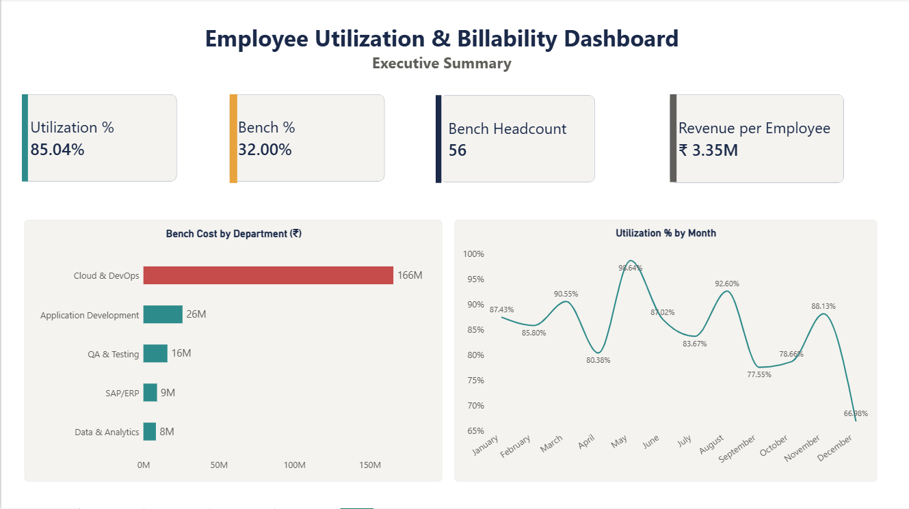
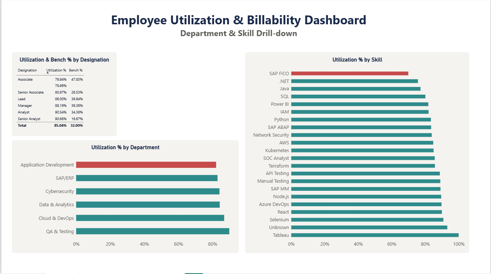
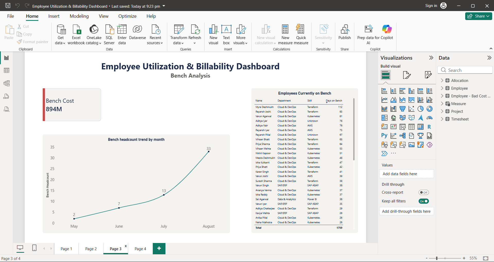
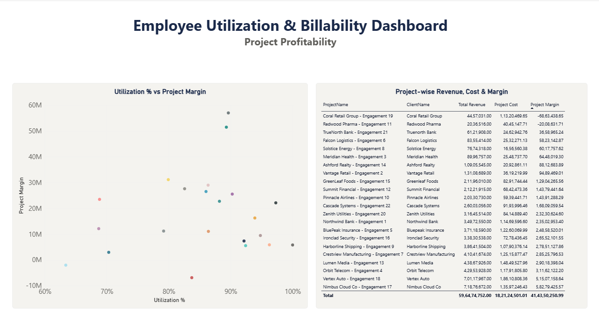

# Employee Utilization & Billability Dashboard

A Power BI dashboard analyzing workforce utilization, bench cost, and project profitability for an IT-services business scenario.

## Problem Statement

IT services companies generate revenue by billing employee hours to clients — every employee who isn't assigned to billable work ("on bench") is a pure cost with no offsetting revenue. This dashboard helps Resource Managers, Delivery Managers, and Finance teams answer: **who's on bench, for how long, and which projects are actually profitable?**

## Dashboard Preview

**Page 1 — Executive Summary**

**Page 2 — Department & Skill Drill-down**

**Page 3 — Bench Analysis**

**Page 4 — Project Profitability**

## Tech Stack

Power BI · DAX · Power Query · Excel (data source)

## Data Model

A star schema with 4 tables:
- **Employee** (dimension) — Department, Designation, Skill, Location, MonthlyCost
- **Project** (dimension) — Client, Billing Rate, Start/End Date
- **Allocation** (fact/bridge) — links employees to projects/bench, with BillableStatus and HoursAllocated
- **Timesheet** (fact) — daily actual hours logged

~180 employees, 22 projects, ~880 allocation records, ~6,700 timesheet entries.

## Key Features

- Star-schema data model built and validated in Power BI's Model view
- 13 DAX measures, including point-in-time logic (`Bench Headcount`, `Bench Cost`, `Days on Bench` all calculated *as of the latest date in the data*, not cumulatively — an easy mistake to make and correct)
- Full Power Query cleaning pipeline: deduplication, text standardization, mixed-date-format parsing, missing-value handling, and invalid-value flagging (rather than silent deletion)
- 4-page report, each page purpose-built for a specific audience:
  | Page | Audience | Purpose |
  |---|---|---|
  | Executive Summary | Leadership | Headline KPIs at a glance |
  | Department & Skill Drill-down | Resource Managers | Where is the problem concentrated? |
  | Bench Analysis | Resource Managers / HR | Who needs action, and bench trend over time |
  | Project Profitability | Finance / Delivery | Which projects are actually making money |
- Consistent design system: Segoe UI typography, a navy/teal/amber/red color scheme where color always carries the same meaning (red = problem, teal = healthy) across every page

## Key Insights

- **Cloud & DevOps shows a ~43% bench rate**, compared to ~23-29% in other departments — pointing to a hiring/skilling mismatch rather than a client-demand issue.
- **2-3 projects are fully staffed (high utilization) yet run at a loss** — a scatter plot of Utilization % vs Project Margin surfaces this directly, driven by underpriced billing rates relative to staffing cost.
- **Bench headcount trended upward** over the observed period, visible on the Bench Analysis page.

## Data Note

Bench allocation, billing rates, and project margins are confidential internal data for every company — no organization publishes this externally. This project uses a **synthetic dataset** designed to mirror the real structure and constraints IT services companies work with, with realistic patterns (skill-based bench imbalance, underpriced projects) intentionally built in for meaningful analysis.

## Files in This Repo

- `employee_utilization_dashboard.pbix` — the Power BI file
- `employee_utilization_dataset.xlsx` — the synthetic source dataset (4 sheets)
- `documentation.md` — full case-study documentation: business context, data model reasoning, DAX logic, design decisions, and debugging notes
- `screenshots/` — dashboard page previews

## Author

Priyanka Tawde — [GitHub](https://github.com/priyankatawde17)
